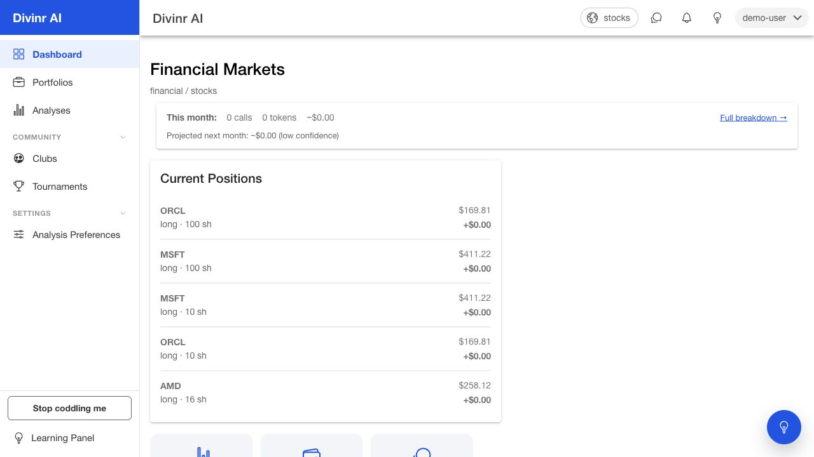

# Divinr.ai

[](LICENSE)
[](https://github.com/golfergeek/divinr.ai/actions/workflows/markets-ci.yml)

Divinr.ai is an AI-assisted market analysis and learning platform. It combines a multi-analyst reasoning panel, simulated portfolios, learning clubs, paper-trading tournaments, and authoring tools for users who want transparent signal generation without placing real trades.

The product is built around one rule: Divinr is for analysis, education, and simulated practice. It is not a prediction model and it is not investment advice.

## Why This Repository Matters

This monorepo shows the working product surface and the engineering system behind it:

- A Vue/Ionic web app with authenticated product surfaces, onboarding, social workflows, billing, and admin tools.
- A NestJS API with background analysis pipelines, paper-trading state, learning loops, billing integration, and RBAC-guarded endpoints.
- Shared packages for transport contracts and infrastructure planes.
- E2E, compliance, market-pipeline, and unit test suites used to keep the system verifiable.
- Local-first development defaults, including local LLM routing through Ollama and no-op behavior when optional external credentials are absent.

## Product Capabilities

Divinr currently includes:

- **AI analyst panel**: five personality-driven analysts, an arbitrator, portfolio manager, and day-trader strategies that produce independent analysis with rationale, conviction, and cited evidence.
- **Transparent reasoning**: analyst outputs preserve written rationale, source context, confidence, and outcome history so users can inspect why a signal was produced.
- **Paper trading**: simulated portfolios, signal-to-trade intent, live intraday P&L, leaderboard ranking, and tournament workflows. No real securities are bought or sold.
- **Learning system**: per-analyst calibration, entity-level attribution, nightly evaluation, audit findings, and graduation paths for well-performing authored analysts.
- **Authoring tools**: custom analyst contracts, custom instruments, triple-slot enablement, BYO model credentials, and cost attribution.
- **Social learning**: investment learning clubs, mentoring, club activity, direct messages, signal challenges, and paper-trading tournaments.
- **Onboarding and trust**: first-touch walkthroughs, beginner tour, centralized legal disclaimers, and consistent "analysis/signal" language across user-facing copy.
- **Billing and operations**: Stripe-backed trial and subscription lifecycle in test mode, student pricing, customer portal flows, and RBAC-gated operator billing tools.

The authoritative feature inventory lives in [docs/features.md](docs/features.md). A more narrative product explainer is available in [docs/what-divinr-can-do.md](docs/what-divinr-can-do.md).

## Product Preview

The highest-signal demo path is:

1. Start at the dashboard and show the current portfolio, tournament standing, and surfaced analysis.
2. Open an analysis detail and inspect rationale, conviction, and cited evidence.
3. Convert the signal into a simulated paper-trade ticket.
4. Open tournaments to show leaderboard movement and virtual positions.
5. Open clubs to show social learning, mentoring, activity, and curriculum context.
6. Open authoring or operator tools for technical audiences.

Use [docs/demo-script.md](docs/demo-script.md) for a call-ready walkthrough. Product screenshots belong in [docs/screenshots/](docs/screenshots/) and should avoid private data or credentials.



More reviewer screenshots:

- [Analysis list](docs/screenshots/analyses.jpg)
- [Analysis detail](docs/screenshots/analysis-detail.jpg)
- [Portfolios](docs/screenshots/portfolios.jpg)
- [Tournaments](docs/screenshots/tournaments.jpg)
- [Clubs](docs/screenshots/clubs.jpg)
- [Learning Panel](docs/screenshots/learning-panel.jpg)

## Intended Users

Divinr is designed for three primary audiences:

- Students and club members learning market analysis through structured, no-real-money practice.
- Finance-curious beta users who want readable AI market analysis and simulated competition.
- Technical power users who want to author analysts, bring their own model credentials, inspect cost, and understand model behavior.

See [docs/personas.md](docs/personas.md) for the full persona definitions.

## Reviewer Documents

- [Technical overview](docs/technical-overview.md)
- [Roadmap and known limitations](docs/roadmap.md)
- [Demo script](docs/demo-script.md)
- [Feature inventory](docs/features.md)
- [Security policy](SECURITY.md)
- [Contact-first contribution notes](CONTRIBUTING.md)
- [License and brand notice](NOTICE.md)

## Architecture

```text
apps/
  api/      NestJS API, background jobs, billing, market pipelines, auth
  web/      Vue 3 + Ionic + Pinia web app, Vite dev server, Electron wrapper
  e2e/      Playwright regression suites
  ios/      Capacitor/iOS shell

packages/
  transport-types/       Shared API transport types
  planes/                Shared infrastructure plane utilities
  prediction-planes/     Market-analysis plane package

docs/
  features.md            Authoritative shipped/in-progress/planned inventory
  efforts/               PRDs, implementation plans, completion reports
  testing/               Test findings and workflow notes
```

The local development stack uses:

- pnpm workspaces and Turbo
- TypeScript
- NestJS
- Vue 3, Ionic Vue, Pinia, Vite
- PostgreSQL
- Playwright
- Stripe test-mode integration
- Ollama/local LLM routing by default, with optional commercial provider keys

## Local Setup

Prerequisites:

- Node.js compatible with pnpm 10.8.0
- pnpm
- Docker
- PostgreSQL via the provided compose stack
- Optional: Ollama for local LLM-backed pipeline runs
- Optional: Stripe CLI for webhook forwarding

Install dependencies:

```bash
pnpm install
```

Create local environment configuration:

```bash
cp .env.example .env
```

Start Postgres:

```bash
docker compose up -d
```

Build packages:

```bash
pnpm -w run build
```

Bootstrap schema and start the API:

```bash
pnpm --filter @divinr/api run dev:up
```

Start the web app in another terminal:

```bash
pnpm --filter @divinr/web run dev
```

Default local ports:

- API: `http://localhost:7100`
- Web: `http://localhost:7101`
- Postgres: `localhost:5434`

## Quality Gates

Common repository checks:

```bash
pnpm -w run lint
pnpm -w run typecheck
pnpm -w run build
pnpm -w run test
pnpm -w run e2e
```

Market-specific and compliance gates:

```bash
pnpm -w run ci:compliance
pnpm -w run ci:markets
pnpm -w run verify:markets
```

## Development Notes

### Schema Bootstrap

Normal request handlers must not mutate schema. Run schema work through:

```bash
pnpm --filter @divinr/api run bootstrap:schema
```

`pnpm --filter @divinr/api run dev:up` runs schema bootstrap before starting the API and fails readiness if required schema state is missing.

### Stripe

The API and Stripe webhook forwarder boot together through:

```bash
pnpm --filter @divinr/api run dev:up
```

When `STRIPE_SECRET_KEY` is set in `.env`, the script starts:

- `node dist/src/main.js`, with logs at `/tmp/divinr-api.log`
- `stripe listen --forward-to localhost:7100/billing/webhooks/stripe`, with logs at `/tmp/divinr-stripe-listen.log`

When `STRIPE_SECRET_KEY` is absent, Stripe code paths return `null` or no-op and the app runs without billing side effects.

### LLM Routing

Market execution defaults to local/open-source models:

```bash
OPENSOURCE_LLM_PROVIDER=ollama_local
DEFAULT_OPENSOURCE_MODEL=qwen3:8b
```

Enable LLM-backed run processing with:

```bash
MARKETS_ENABLE_LLM=true
```

Commercial fallback remains disabled unless explicitly enabled:

```bash
MARKETS_ALLOW_COMMERCIAL_FALLBACK=false
```

### External Crawler Sync

The API can reuse existing Orchestrator crawler data from `crawler.sources` and `crawler.articles` and sync it into Divinr market articles.

Environment flags:

```bash
MARKETS_EXTERNAL_SYNC_ENABLED=true
MARKETS_EXTERNAL_SYNC_ORG_SLUG=<orchestrator-org-slug>
MARKETS_EXTERNAL_SOURCE_LIMIT=500
MARKETS_EXTERNAL_ARTICLE_LIMIT=5000
MARKETS_EXTERNAL_ARTICLE_LOOKBACK_DAYS=14
```

Endpoints:

- `POST /markets/data/sync/external-crawler`
- `GET /markets/articles`

## Conventions Worth Knowing

- Every NestJS constructor parameter in the API uses explicit `@Inject(...)`; tests run through `tsx`, which does not emit `design:paramtypes` metadata.
- New user-facing surfaces require first-touch onboarding coverage and matching entries in `apps/web/src/onboarding/surface-content.ts`.
- New user-facing surfaces also need testing coverage through an existing or new deep browser skill plus Playwright coverage.
- User-visible web copy should say "analysis" or "signal", not "prediction", "advice", or "recommendation". Code identifiers and admin/debug surfaces are exempt where the domain model requires them.
- User-visible disclaimers route through `apps/web/src/components/LegalDisclaimer.vue`.

## Status

This repository is open source under MIT and represents the active Divinr.ai product codebase. Production secrets, hosted infrastructure, private data, paid data subscriptions, and private brand assets are not included.

The README is intended to help technical reviewers, contract prospects, funding viewers, and collaborators understand the product scope, architecture, and local development flow quickly.

## License

This project is available under the [MIT License](LICENSE).

The Divinr.ai name, marks, hosted service identity, and private brand assets are not automatically licensed for reuse. See [NOTICE.md](NOTICE.md).
